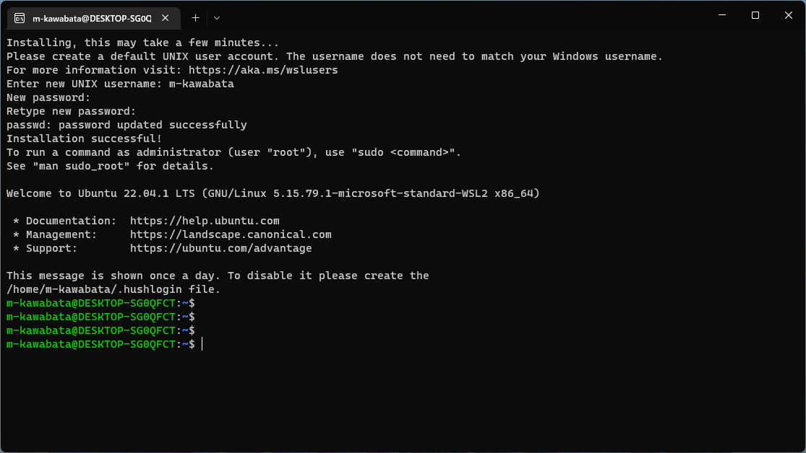

# Windowsへdockerをインストール

## 環境準備

必要なもの

- メモリ8GB以上
- 250GB以上あるディスク
- Windows10 バージョン2004以降 or Windows11
- VSCode
- 豊潤なインターネット回線
- やる気

あるとちょー便利なもの

- Windows Terminal
    - MicrosoftStoreから入手

### 前提条件

dockerを使用するためには、WSL2を入れる必要があります。

Windows 10 バージョン 2004 より低い場合は、[こちら](https://learn.microsoft.com/ja-jp/windows/wsl/install-manual)を見て手動で入れてください。

## WSL2のインストール

PowerShellを管理者権限で開き、以下コマンドを実行。

```
wsl --install
wsl --set-default-version 2
```

デフォルトでUbuntuがLinuxとしてインストールされます。

インストール後、再起動を促されるので、再起動後、初期セットアップを進めます。

```
Enter new UNIX username:<好きなローマ字の名前>
New password:<as you like>
Retype new password: <as you like>
```



## メモリ割り当て

デフォルトでは、WSLはホスト機の最大80%を予約します。
メモリ消費量を抑えるため、下記フォルダに`.wslconfig`というファイルを置きます。

```
C:\Users\[ユーザ名]\.wslconfig
```

ファイルの中に、cpuコア数とメモリの最大量を指定します。

```
[wsl2]
processors=3
memory=3GB
```

## dockerインストール

WSL内のUbuntuにdockerをインストールします。
[公式の手順はこちら](https://docs.docker.com/engine/install/ubuntu/)にありますが、以下の手順でインストールします。

```
# パッケージを最新化
sudo apt-get update

# 前提パッケージをインストール
sudo apt-get install \
  ca-certificates \
  curl \
  gnupg \
  lsb-release

# 鍵を登録
sudo mkdir -p /etc/apt/keyrings
curl -fsSL https://download.docker.com/linux/ubuntu/gpg | sudo gpg --dearmor -o /etc/apt/keyrings/docker.gpg

# dockerのリポジトリを登録
echo \
  "deb [arch=$(dpkg --print-architecture) signed-by=/etc/apt/keyrings/docker.gpg] https://download.docker.com/linux/ubuntu \
  $(lsb_release -cs) stable" | sudo tee /etc/apt/sources.list.d/docker.list > /dev/null

# dockerインストール
sudo apt-get update
sudo apt-get install docker-ce docker-compose-plugin
```

インストールが終わったら、自ユーザにdockerグループを追加します。

```
sudo usermod -aG docker $(whoami)
```

WSLにログインした時点でdockerが自動で起動する設定を入れます。
ユーザホームにある`.profile`の最終行に、以下の記述を追記します。

```
sudo /etc/init.d/docker start
echo "sudo /etc/init.d/docker start" >> .profile
```

いったんログアウト後、ログインした後以下コマンドを打って、dockerが起動しているかを確認します。

```
# いったんUbuntsuから抜ける
exit

# 再度ログインして、下記コマンドを実行
docker run --rm hello-world
```

`Hello from Docker!`と表示されればOKです。
